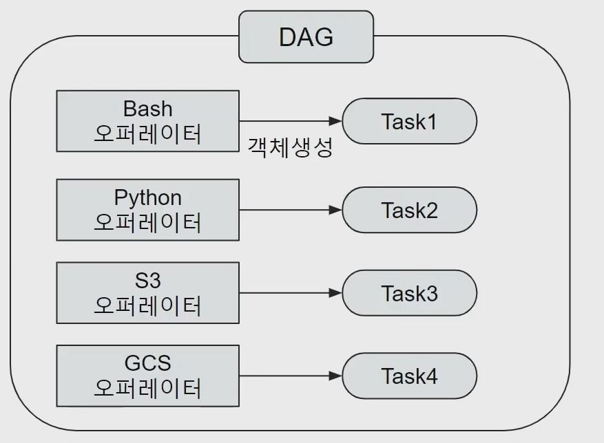
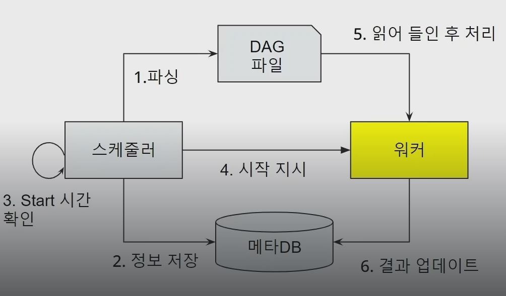

## 1. Airflow DAG생성(Bash Operator)

- Operator
    - 특정 행위를 할 수 있는 기능을 모아 놓은 클래스, 설계도

- Task  
    - Operator에서 객체화(Instance화)되어 DAG에서 실행 가능한 오브젝트

- Bash Operator
    - 쉘 스크립트 명령을 수행하는 Operator

    

## 2. Task의 수행 주체

- 스케줄러
    - DAG Parsing 후 DB에 정보 저장
    - DAG 시작 시간 결정

- 워커
    - 실제 작업 수행