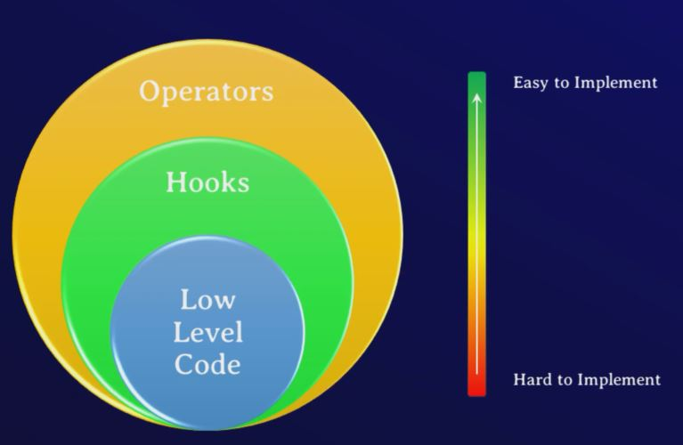

## 1. What are Hooks?

- Hooks are pre-built python classes
- Hooks simplify our interaction with external systems

## 2. Hooks vs Operator

- Airflow Hooks and Operators are both Python classses
- But they differ in their level of abstraction.

    

## 3. 