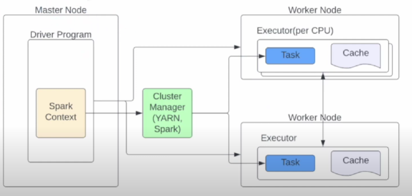

## 1. Why Spark?

The Resilient Distributed Dataset(RDD) - Main Concept.

## 2. RDD

1. Lazy Evaluation
    - Python의 Generator에 해당
    - Action이 있기 전에는 계산하지 않기 때문에 결과를 알아야 할 때 Optimal한 Flow 알 수 있음

2. In-Memory Computation
    - 메모리로 하기 때문에 빠름
3. Fault Tolerance
    - 여러개의 노드로 나눠져있기 때문에 더 안전
4. Immutability
    - 프로세스 도중에는 데이터가 바뀌지 않음. 
    - 이를 통해 더 빠르게 수행
5. Partitioning
6. Location setup capability
    - 현재 사용 데이터를 어떤 노드에서 사용할지 설정할 수 있음

## 3. Apache Spark 3

1. RDD Based - MLLib is mainterance 
    - Dataframe based MLLib
2. Spark3 is faster 
    - 17x faster than Spark2
3. Python2 is deprecated
4. Deeper Kubernetes Support
5. Binary File Support
6. SparkGraph with Cypher
7. ACID support in data lakes with Delta Lake
8. GPU instance support