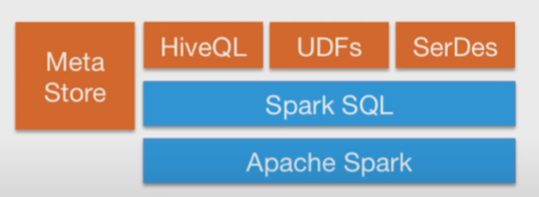

### 1. What is SparkSQL?

SparkSQL is Apache Spark module for working with structured data.

Extends RDD to "DataFrame" Object

DataFrame can ...
- run SQL query like normal SQL
- have a schema
- read / write to JSON, CSV, Hive, Avro, Parquet, ORC
- talks to JDBC / ODBC, Tableau

### 2. Integrated

Apply functions to results of SQL Queries.

```Python
results = spark.sql("SELECT * FROM people")
names = results.map(lambda p: p.name)
```

### 3. Uniform data access

Query and Join different Data Sources.

```Python
spark.read.json("s3n://...").registerTempTable("json")

results = spark.sql("""SELECT * FROM people JOIN json ...""")
```

### 4. Hive Integration

Spark SQL can use existing Hive metastores, SerDes, and UDFs.



### 5. Standard Connectivity

Use your existing BI tools to query Big Data.

- BI Tools
- JDBC / ODBC
- Spark SQL 

